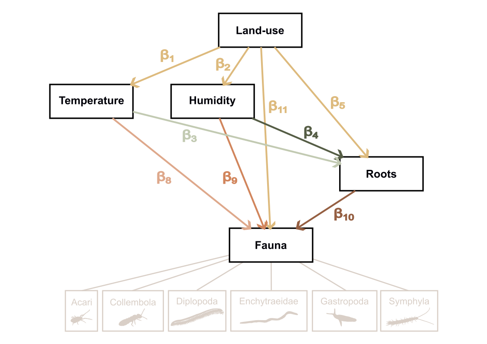

# From pixels to patterns : **High-throughput in-situ imaging unveils soil fauna dynamics in agroforestry systems**

------------------------------------------------------------------------

This repository contains the R scripts associated with the publication *"From pixels to patterns: high-throughput in-situ imaging unveils soil fauna dynamics over a year in agroforestry systems"*, currently in preparation. The study uses continuous in situ imaging at high temporal resolution to investigate how land-use shapes the environmental drivers of soil invertebrate activity in a Mediterranean agroforestry context.

------------------------------------------------------------------------

## Study description

Soil invertebrate communities were monitored at 6-hour resolution over nearly two years using underground scanners deployed across two contrasted land-use positions within the same agroforestry system: position **C** (managed — cultivated cover) and position **A** (unmanaged — tree cover with herbaceous vegetation). By combining faunal activity time series with continuous measurements of root dynamics and paired microclimate indices, we apply a rolling-window piecewise SEM to characterise both the direction and the temporal variability of causal pathways linking edaphic conditions to soil faunal activity. The rolling-window approach — fitting the model repeatedly on successive overlapping time windows rather than on the full series — is central to the study design: it yields a distribution of standardised path coefficients over time, capturing how the strength and sign of causal links fluctuate across seasons and disturbance events.

------------------------------------------------------------------------

## Research questions and hypotheses under development

The overarching question is whether perennial vegetation buffers soil communities against environmental fluctuations — and through which causal pathways this buffering operates.

**H1 — Land-use effects on soil conditions.** Managed (cultivated) systems are expected to increase the variability and extremes of microclimate, root resource supply, and faunal abundance relative to unmanaged (treed) systems. Exposed soils amplify thermal and moisture fluctuations, while periodic management interventions (tillage, harvest, irrigation) generate episodic resource pulses with no equivalent under continuous perennial cover.

**H2 — Shift in environmental forcing pathways.** In cultivated soils, faunal activity is expected to be strongly and directly coupled to abiotic forcing — microclimate extremes and resource inputs drive abundance in a bottom-up, environmentally controlled manner. Under tree cover, where abiotic variability is dampened, biotic pathways (root-mediated resource supply, trophic interactions) are expected to carry proportionally more weight. This represents a qualitative shift in the causal architecture governing soil communities, not merely a difference in effect sizes.

**H3 — Temporal synchrony of causal rules.** Because both systems share the same regional climate signal, abiotic forcing paths (microclimate → fauna) are expected to remain temporally synchronised between A and C across most of the year. Synchrony is expected to break down in summer, when irrigation and other management-specific interventions in C decouple local soil conditions from the ambient climate, creating system-specific dynamics that are absent in A.

------------------------------------------------------------------------

## Causal model (piecewise SEM)



The model is fitted independently on overlapping rolling time windows. All variables are z-score standardised prior to modelling, making path coefficients directly comparable across taxa and predictors. `land_use` (0 = A, 1 = C) is the exogenous binary driver and is deliberately excluded from z-scoring so that interaction coefficients retain their interpretation as slope differences between management types.

**Tier 1 — land use shapes microclimate**

```         
microclimate_1 ← β₁ · land_use
microclimate_2 ← β₂ · land_use
```

**Tier 2 — microclimate × land use drives root growth**

```         
root ← β₃ · mc₁ + β₄ · mc₂ + β₅ · land_use
     + β₆ · (mc₁ × land_use) + β₇ · (mc₂ × land_use)
```

**Tier 3 — microclimate + root × land use drives fauna**

```         
fauna ← β₈ · mc₁ + β₉ · mc₂ + β₁₀ · root + β₁₁ · land_use
      + β₁₂ · (mc₁ × land_use) + β₁₃ · (mc₂ × land_use)
      + β₁₄ · (root × land_use)
```

Each equation includes a nested random intercept (`orientation / depth`) and an AR(1) correlation structure to account for temporal autocorrelation within scanner groups. A residual covariance term (`microclimate_1 %~~% microclimate_2`) captures shared physical drivers not represented by the binary land-use contrast.

The interaction structure produces an intentional asymmetry in the output: `std_estimate` is the path slope in the unmanaged system (land_use = 0, baseline); `std_estimate_C` is the total slope in the managed system (main effect + interaction). `p_value` tests whether the slope in A differs from zero; `interaction_p_value` tests whether the slope in C differs from the slope in A. There is no direct significance test for the slope in C alone — this asymmetry is carried through all figures and tables in script 4.

------------------------------------------------------------------------

## Pipeline

| Script | Role | Key output |
|------------------------|------------------------|------------------------|
| `1_database_edition.qmd` | Fauna, microclimate, root, and season assembly | `SEM_database.csv` |
| `2_SEM_diagnostic.qmd` | Sensitivity analysis — window × completeness × transformation (120 combinations) | `model_parameters.txt` |
| `3_SEM_modelisation.qmd` | Full rolling-window SEM across all taxa | `SEM_results_database.csv` |
| `4_SEM_results_analysis.qmd` | Figures and tables for H1–H3 | TIFF figures |

Scripts must be run in order. Script 2 is computationally intensive (120 parameter combinations × 50 sampled windows each).

``` r
quarto::quarto_render("scripts/1_database_edition.qmd")
quarto::quarto_render("scripts/2_SEM_diagnostic.qmd")
quarto::quarto_render("scripts/3_SEM_modelisation.qmd")
quarto::quarto_render("scripts/4_SEM_results_analysis.qmd")
```

------------------------------------------------------------------------

## Repository structure

```         
project/
├── data/
│   ├── fauna_data.csv
│   ├── root_pixels_count.csv
│   ├── Diams_AF1W_soil.csv
│   └── Diams_AF1W_air.csv
├── output/                          # generated, not versioned
│   ├── SEM_database.csv
│   ├── SEM_results_database.csv
│   ├── model_parameters.txt
│   └── *.tiff
└── scripts/
    ├── 1_database_edition.qmd
    ├── 2_SEM_diagnostic.qmd
    ├── 3_SEM_modelisation.qmd
    └── 4_SEM_results_analysis.qmd
```
