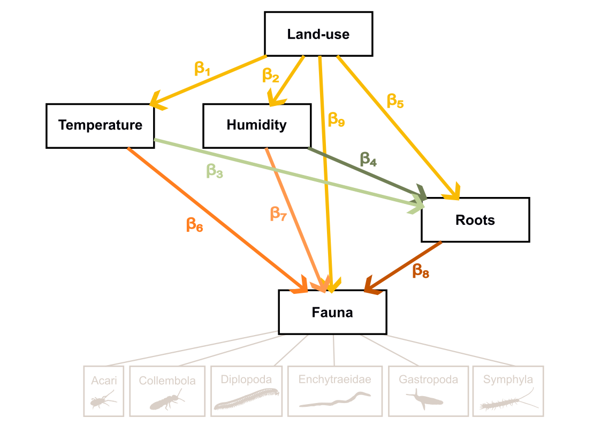

# From pixels to patterns

### High-throughput in-situ imaging unveils soil fauna dynamics over a year in agroforestry systems

------------------------------------------------------------------------

## Study context

This study analyses **soil invertebrate community dynamics** across an agroforestry system using a year-long time series of scanner images captured at high temporal resolution. By combining automated faunal detection, root growth metrics, and continuous microclimate monitoring, we investigate how land-use shapes the environmental drivers of soil biological activity.

Two contrasted positions are compared throughout the analysis:

| Position | Land use  | Description                          |
|----------|-----------|--------------------------------------|
| **A**    | Unmanaged | Tree cover and herbaceous vegetation |
| **C**    | Managed   | Cultivated cover                     |

------------------------------------------------------------------------

## Scientific questions and hypotheses

> *Does perennial vegetation buffer soil communities against environmental fluctuations?*

We test two complementary hypotheses:

**H1 — Land-use effects on soil conditions** Managed (cultivated) systems increase the variability and extremes of soil conditions — in terms of microclimate, root resource supply, and faunal abundance — relative to unmanaged (treed) systems.

**H2 — Shift in activity drivers** In cultivated soils, faunal activity is strongly coupled to abiotic fluctuations and resource inputs, whereas under trees it is more governed by internal biotic regulation within complex communities.

Together, these hypotheses test the broader idea that **structural complexity enhances the self-organisation and resilience of soil communities** in the face of global change.

------------------------------------------------------------------------

## Statistical approach

Causal relationships are modelled using a **piecewise SEM** (`piecewiseSEM`, Lefcheck 2016), fitted independently on overlapping rolling time windows rather than the full time series. This yields a distribution of standardised path coefficients (β) over time, capturing the temporal variability of causal links — a key feature for testing H1 and H2. All variables are z-score standardised prior to modelling, making β directly comparable across taxa and predictors. To distinguish deterministic signal from random noise, a null distribution is generated by independently permuting all causal variables across 30 iterations; observed coefficients with \|z\| \> 1.96 relative to this null are considered non-random.



------------------------------------------------------------------------

## Analysis pipeline

### Script 1 — `1_database_edition.qmd`

Builds the integrated SEM dataset from five raw data streams:

-   **Fauna detections** — filters to 6-hour scan intervals; recodes fine-level taxa to higher taxonomic groups; fills missing taxon–date combinations with 0 (absent) vs. NA (scanner offline)
-   **Soil and air probes** — joins microclimate measurements by date × depth × position
-   **Microclimatic indices** — computes five rolling-window summary statistics per environmental variable (median, amplitude, rate of change, max, min); selects the two most informative and orthogonal indices via PCA
-   **Root density** — derives 9-day and 24-hour root growth metrics from pixel counts using backward rolling joins; converts to cm²
-   **Seasonal labels** — assigns astronomical seasons (spring / summer / autumn / winter)

**Outputs:** `SEM_database.csv`, `fauna_vars.txt`, `microclimate_index.txt`

------------------------------------------------------------------------

### Script 2 — `2_SEM_diagnostic.qmd`

Runs a **sensitivity analysis** across a full factorial grid (140 combinations) of three structural parameters before committing to the final model configuration:

| Parameter                 | Values tested                       |
|---------------------------|-------------------------------------|
| Window duration           | 5, 7, 10, 14, 21, 28, 30 days       |
| Minimum data completeness | 10 %, 20 %, 30 %, 40 %, 50 %        |
| Data transformation       | none, Freeman-Tukey, log, Hellinger |

For each combination, the pipeline runs on 50 randomly sampled windows and evaluates four diagnostics: heteroscedasticity (Spearman ρ \< 0.4), skewness (\|skew\| \< 1.5), collinearity (VIF \< 5), and marginal R². The optimal configuration is selected by maximising joint model validity and explanatory power across both response variables (root, fauna).

**Outputs:** `benchmark_results_database.csv`, `model_parameters.txt`

------------------------------------------------------------------------

### Script 3 — `3_SEM_modelisation.qmd`

Applies the validated parameters from script 2 to run the **full rolling-window piecewise SEM** across all taxa and positions. The causal structure is:

The causal model has four structural equations organised in three tiers, with `land_use` (0 = unmanaged, 1 = managed) as the exogenous driver:

$$\text{Tier 1} \quad \text{microclimate}_1 \leftarrow \beta_1 \cdot \text{land\_use}$$ $$\phantom{\text{Tier 1}} \quad \text{microclimate}_2 \leftarrow \beta_2 \cdot \text{land\_use}$$ $$\text{Tier 2} \quad \text{Root} \leftarrow \beta_3 \cdot \text{microclimate}_1 + \beta_4 \cdot \text{microclimate}_2 + \beta_5 \cdot \text{land\_use}$$ $$\text{Tier 3} \quad \text{Fauna} \leftarrow \beta_6 \cdot \text{microclimate}_1 + \beta_7 \cdot \text{microclimate}_2 + \beta_8 \cdot \text{Root} + \beta_9 \cdot \text{land\_use}$$

Each equation uses a nested random intercept (`orientation / depth`) and an AR(1) correlation structure. A **null distribution** is generated via 30 permutation iterations to confirm that observed path coefficients are non-random.

**Outputs:** `SEM_results_database.csv`

------------------------------------------------------------------------

### Script 4 — `4_SEM_results_analysis.qmd`

Produces four temporary analytical sections from the path coefficient database:

1.  **Environmental forcing** — raincloud plots of standardised β across management types; conditional R² distributions
2.  **Deterministic vs. stochastic processes** — z-score distributions of observed coefficients relative to the permutation null
3.  **Temporal stability** — coefficient of variation (CV) of path coefficients across rolling windows
4.  **Spatial synchrony** — Pearson r and rolling correlation of path coefficients between positions A and C over time

**Outputs:** `1.sem_results_distribution.tiff`

------------------------------------------------------------------------

## Repository structure

```         
project/
│
├── data/                               # Raw input data (not versioned)
│   ├── fauna_data.csv                  # Invertebrate detections from scanner images
│   ├── root_pixels_count.csv           # Root pixel counts per image
│   ├── Diams_AF1W_soil.csv             # Soil temperature and humidity (probe data)
│   └── Diams_AF1W_air.csv              # Air temperature and humidity (probe data)
│
├── output/                             # Generated files (not versioned)
│   ├── SEM_database.csv                # Integrated analysis-ready dataset
│   ├── fauna_vars.txt                  # Selected invertebrate taxa
│   ├── microclimate_index.txt          # Selected microclimatic indices
│   ├── benchmark_results_database.csv  # Full sensitivity analysis results
│   ├── model_parameters.txt            # Optimal model configuration (JSON)
│   ├── SEM_results_database.csv        # Path coefficients and diagnostics
│   └── 1.sem_results_distribution.tiff # Main results figure
│
├── scripts/
│   ├── 1_database_edition.qmd          # Data preparation pipeline
│   ├── 2_SEM_diagnostic.qmd            # Sensitivity analysis
│   ├── 3_SEM_modelisation.qmd          # Model execution and coefficient extraction
│   └── 4_SEM_results_analysis.qmd      # Visualisation and ecological interpretation
│
└── README.md
```

------------------------------------------------------------------------

## How to reproduce

Run scripts in order:

``` r
quarto::quarto_render("scripts/1_database_edition.qmd")
quarto::quarto_render("scripts/2_SEM_diagnostic.qmd")
quarto::quarto_render("scripts/3_SEM_modelisation.qmd")
quarto::quarto_render("scripts/4_SEM_results_analysis.qmd")
```

> ⚠️ Scripts 2 and 3 are computationally intensive. Script 2 benchmarks 175 parameter combinations × 50 windows; script 3 runs the full SEM across all taxa, positions, and time windows. Allow several hours of computation time on a standard workstation.

------------------------------------------------------------------------
