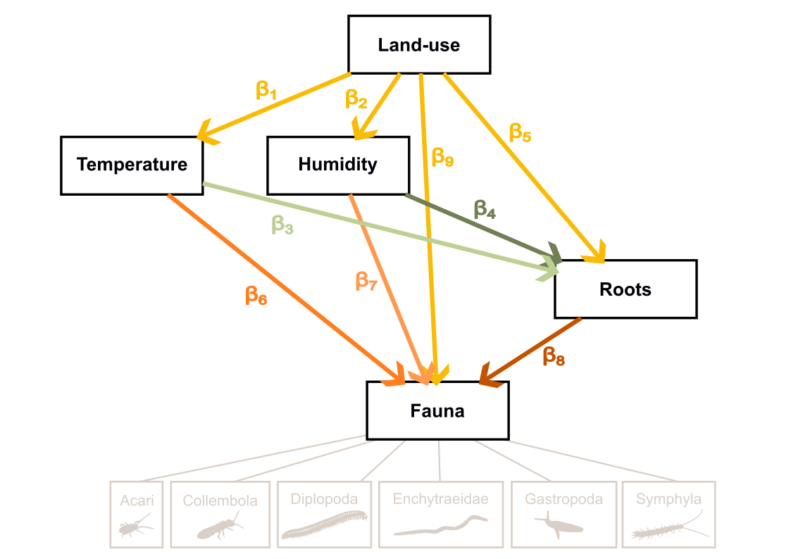

## Study description

Soil invertebrate communities were monitored at 6-hour resolution over nearly two years using eight buried scanners deployed across two contrasted land-use positions within the same Mediterranean agroforestry system: position **A** (unmanaged — treed cover with permanent herbaceous vegetation) and position **C** (managed — open cultivated area). By combining faunal activity time series with continuous measurements of root dynamics and paired microclimate indices, we apply a rolling-window piecewise structural equation model (pSEM) to characterise both the direction and the temporal variability of causal pathways linking edaphic conditions to soil faunal activity.

The rolling-window approach — fitting the model on successive overlapping 14-day windows advanced in daily steps rather than on the full time series — is central to the study design. It yields a distribution of standardised path coefficients over time, capturing how the strength and sign of causal links fluctuate across seasons and in direct response to management events. A divergence index is additionally computed per window to track whether land-use forcing compresses or sustains inter-taxon response heterogeneity.

## Study site

The study was conducted at the experimental agroforestry site **DIAMs** (*Dispositif Instrumenté en Agroforesterie Méditerranéenne sous contrainte hydrique*) established in 2017 at the INRAE experimental station UE Diascope (Mauguio, Hérault, France; 43.612°N, 3.976°E), under a semi-arid Mediterranean climate (mean annual temperature 15.7 °C, mean annual precipitation 511 mm). Soils are classified as Skeletic Rhodic Luvisols with high stone content (\> 60%) and a clay-rich horizon below 100 cm.

The system combines annual crop rotations with rows of black locust (*Robinia pseudoacacia* L.) spaced 17 m apart, each row bordered by a 2 m-wide permanent grass strip. During the study period, the cropping sequence was: durum wheat (sown Dec 2023, harvested 8 Jul 2024) → sorghum (sown 15 Jul 2024, mown 22 Nov, tilled 25 Nov 2024; irrigated three times in Jul–Aug 2024) → chickpea (sown 14 Mar 2025, harvested 10 Jul 2025).

## Hypotheses

| \# | Statement |
|------------------------------------|------------------------------------|
| **H1** | Land-use effects on soil fauna are inherently non-stationary: their magnitude and direction shift through time in response to seasonal cycles and discrete management events. |
| **H2** | The indirect pathways linking land use to faunal activity vary over time in intensity, as the dominant causal mechanism alternates between microclimatic forcing and resource-mediated (root) pathways. |
| **H3** | Periods of strong land-use forcing reduce response diversity by driving convergence in taxon-specific responses, thereby transiently constraining the functional heterogeneity of the community. |
: Research hypotheses for the rolling-window pSEM analysis {#tbl-hypotheses}

## Causal model (piecewise SEM)

All variables are z-score standardised within each window prior to modelling; land-use type is retained on its binary scale (treed = 0, cultivated = 1). Each structural equation is fitted as a linear mixed-effects model with a nested random intercept (`orientation / depth`) and an AR(1) correlation structure. A residual covariance term (`microclimate_1 %~~% microclimate_2`) captures shared physical drivers not represented by the binary land-use contrast.

> **Tier 1 — Land use shapes microclimate**
> * $\text{microclimate}_1 \leftarrow \beta_1 \cdot \text{land\_use}$
> * $\text{microclimate}_2 \leftarrow \beta_2 \cdot \text{land\_use}$
>
> **Tier 2 — Microclimate × Land use drives root growth**
> * $\text{root} \leftarrow \beta_3 \cdot \text{mc}_1 + \beta_4 \cdot \text{mc}_2 + \beta_5 \cdot \text{land\_use}$
>
> **Tier 3 — Microclimate + Root × Land use drives fauna**
> * $\text{fauna} \leftarrow \beta_6 \cdot \text{mc}_1 + \beta_7 \cdot \text{mc}_2 + \beta_8 \cdot \text{root} + \beta_9 \cdot \text{land\_use}$

Indirect effects are computed as products of standardised path coefficients along each causal route. A total of seven pathway estimates are derived per window: five indirect routes, the total indirect (sum of the five), and the total effect (direct + total indirect).

{#fig-dag width=85%}

## Response diversity (H3)

The rolling-window pSEM is fitted independently for six focal taxa: *Acari*, *Collembola*, *Enchytraeidae*, *Julida*, *Gastropoda*, and *Symphyla*. Per-window divergence in taxon-specific β-estimates is quantified using the index of Ross et al. (2023):

```         
D(w,k) = [max(β) − min(β) − |max(β) + min(β)|] / [max(β) − min(β)]
```

D = 1 when taxon responses span zero symmetrically (half positive, half negative); D = 0 when all taxa respond in the same direction. The relationship between D and the absolute community-level β is modelled with a GLS incorporating an AR(1) error structure.

## Pipeline

Scripts must be run in order. Script 2 is computationally intensive.

| Script | Role | Key outputs |
|------------------------|------------------------|------------------------|
| `1_database_edition.qmd` | Assembles fauna, microclimate, root, and season data into one analysis-ready table | `SEM_database.csv`, `fauna_vars.txt`, `microclimate_index.txt` |
| `2_SEM_diagnostic.qmd` | Sensitivity analysis over 120 (window × completeness × transformation) combinations; selects the optimal modelling configuration | `model_parameters.txt` |
| `3_SEM_modelisation.qmd` | Fits the full rolling-window pSEM for all taxa; computes indirect effects and the divergence index | `SEM_results_database.csv`, `indirect_effects.csv`, `H1_*.csv`, `DAG_*.csv` |
| `4_SEM_results_analysis.qmd` | Produces all figures and tables for H1–H3; no modelling performed | `Fig1–Fig4` TIFF files |

``` r
quarto::quarto_render("scripts/1_database_edition.qmd")
quarto::quarto_render("scripts/2_SEM_diagnostic.qmd")
quarto::quarto_render("scripts/3_SEM_modelisation.qmd")
quarto::quarto_render("scripts/4_SEM_results_analysis.qmd")
```

## Repository structure

```         
project/
├── data/
│   ├── fauna_data.csv                  # Raw invertebrate detections
│   ├── root_pixels_count.csv           # Root pixel counts per image
│   ├── Diams_AF1W_soil.csv             # Soil temperature and moisture
│   └── Diams_AF1W_air.csv              # Air temperature and humidity
├── output/                             # Generated by the pipeline — not versioned
│   ├── SEM_database.csv
│   ├── microclimate_index.txt
│   ├── fauna_vars.txt
│   ├── model_parameters.txt
│   ├── SEM_results_database.csv
│   ├── indirect_effects.csv
│   ├── H1_adjusted_values.csv
│   ├── H1_model_summary.csv
│   ├── DAG_coefficients.csv
│   ├── DAG_model_fit.csv
│   └── Fig*.tiff
└── scripts/
    ├── 1_database_edition.qmd
    ├── 2_SEM_diagnostic.qmd
    ├── 3_SEM_modelisation.qmd
    └── 4_SEM_results_analysis.qmd
```

## Dependencies

All analyses were performed in **R 4.5.2**. Core packages:

| Package        | Role                                         |
|----------------|----------------------------------------------|
| `tidyverse`    | Data wrangling and visualisation             |
| `nlme`         | Linear mixed-effects models                  |
| `piecewiseSEM` | Piecewise structural equation modelling      |
| `MuMIn`        | R² via variance partitioning                 |
| `data.table`   | High-performance rolling joins for root data |
| `ade4`         | Microclimate PCA                             |
| `zoo`          | Rolling-window calculations                  |
| `patchwork`    | Figure composition                           |

------------------------------------------------------------------------

The scanner-based imaging methodology is described in:

> Belaud E., Jourdan C., Barry-Etienne D., Marsden C., Robin A., Taschen E., Hedde M. (2024). In situ soil imaging, a tool for monitoring the hourly to monthly temporal dynamics of soil biota. *Biology and Fertility of Soils* 60, 1055–1071. <https://doi.org/10.1007/s00374-024-01851-8>
